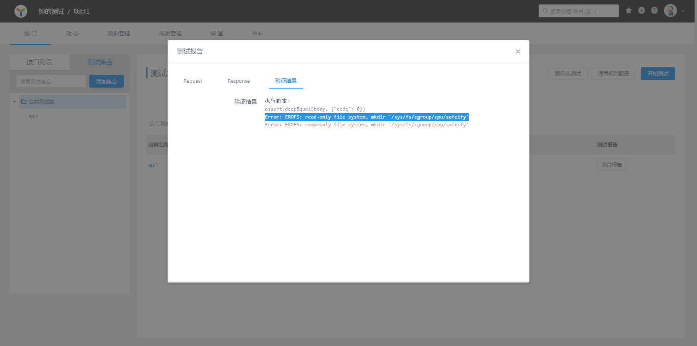

## Deploy Yapi via docker on Ubuntu

##### Install mongodb

```shell
ls
```


<a href="https://www.mongodb.com/docs/manual/tutorial/install-mongodb-on-ubuntu/"> 参考文章 </a>


##### 全过程中我遇到的问题及解决方法
1.
```
bash: gpg: command not found
```
解决方法：
```shell
apt-get install gpg

// amd64 是你的cpu架构，我的因为是树莓派，所以是arm64
echo "deb [ arch=amd64,arm64 signed-by=/usr/share/keyrings/mongodb-server-7.0.gpg ] https://repo.mongodb.org/apt/ubuntu focal/mongodb-org/7.0 multiverse" uj /etc/apt/sources.list.d/mongodb-org-7.0.list

echo "mongodb-org hold" | dpkg --set-selections
echo "mongodb-org-database hold" | dpkg --set-selections
echo "mongodb-org-server hold" | dpkg --set-selections
echo "mongodb-mongosh hold" | dpkg --set-selections
echo "mongodb-org-mongos hold" | dpkg --set-selections
echo "mongodb-org-tools hold" | dpkg --set-selections
```


2.
```
Error: getaddrinfo ENOTFOUND yapi.demo.qunar.com
```
解决方法：
<a href="https://github.com/YMFE/yapi/issues/2180#issuecomment-1423701471"> Github issues </a>


## Deploy Yapi, Docker部署
<a href="https://blog.csdn.net/Chimengmeng/article/details/132074922"> 参考文章 </a>


```shell
docker run -d \
   --name yapi3 \
   --link mongodb:mongo \
   --restart always \
   --net=yapi \
   -p 3000:3000 \
   -v /data/yapi/config.json:/yapi/config.json \
   zhongyapi:latest \
   server/app.js
```




```
验证结果
执行脚本:
assert.notEqual(status, 404)
assert.deepEqual(body, {"code": 0})
Error: EROFS: read-only file system, mkdir '/sys/fs/cgroup/cpu/safeify'
Error: EROFS: read-only file system, mkdir '/sys/fs/cgroup/cpu/safeify'

    - https://blog.csdn.net/iaiti/article/details/125385365
```

备份 sandbox.js
const Safeify = require('safeify').default;

module.exports = async function sandboxFn(context, script)
    // ...... safeify ......
    const safeVm = new Safeify({
        timeout: 3000,
        // zhong
        unrestricted: true,
        asyncTimeout: 60000
    })

    // ..................
    const result = await safeVm.run(script, context)

    // ............
    safeVm.destroy()
    return result
}